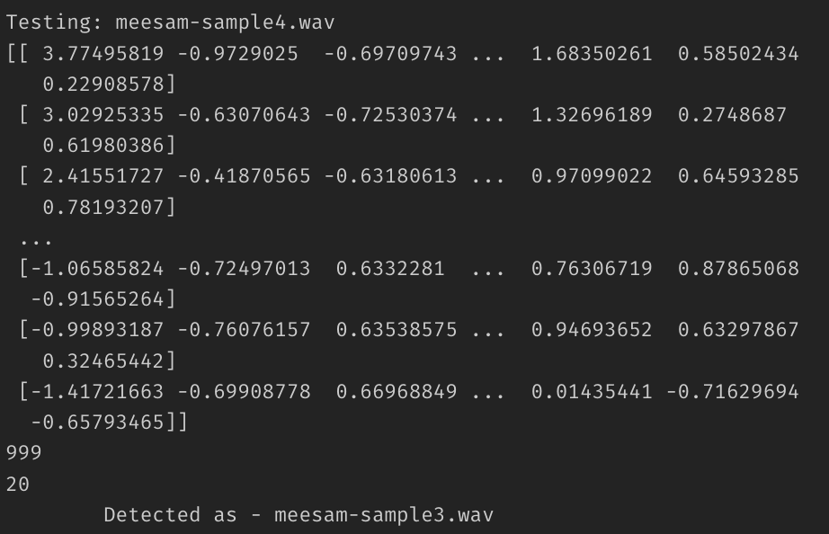
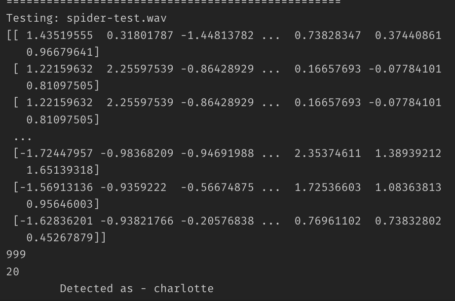
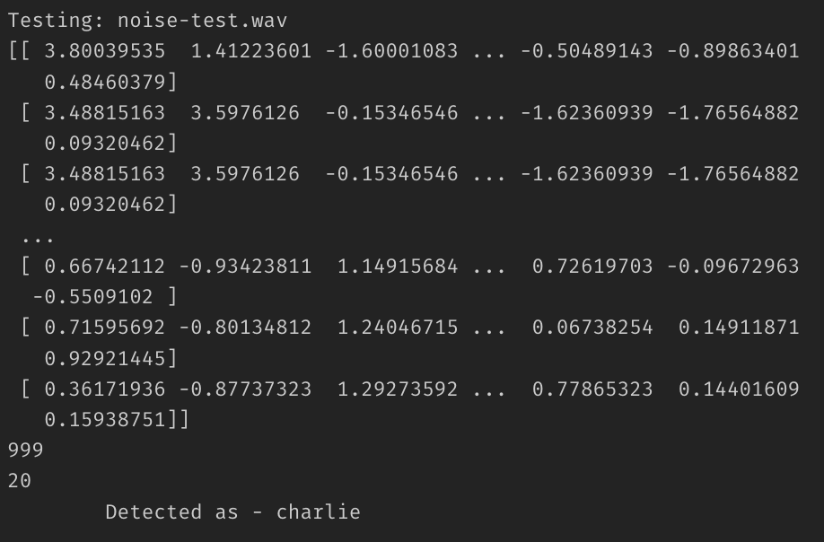

# DESCRIPTION
Using GMM and MFCC to identify user's voice.


# INSTALLATION
Step 1: Create conda environment with python 3.6
Environment Name: audioml
```
conda create -n "audioml" python=3.6
```
Activate the environment and check python version
```
conda activate audioml
python -V
>>> Python 3.6.15
```
Step 2: Install pyaudio, scikit-learn and python-speech-features.
Note: Use conda as it will install all the necessary dependencies for the aforementioned libraries
**Scikit Learn**
```
conda install -c anaconda scikit-learn
# For Intelex Processors - GPU Acceleration
conda install scikit-learn-intelex
>> python -m sklearnex my_application.py
```
**PyAudio**
___
_For PyAudio Installation on Mac M1_
https://discussions.apple.com/thread/252638887

Note: this will ensure that we have all the dependencies needed to record audio, train and test the ML model.
___
_For Ubuntu Users_
```
sudo apt-get install libasound-dev portaudio19-dev libportaudio2 libportaudiocpp0
pip install pyaudio --user
```
___

**Python_Speech_Feature**
```
conda install -c contango python_speech_features
```
Step 3: Install Jupyter Lab in this environment
```
conda install -c "conda-forge/label/cf202003" jupyterlab
```
Note: Standard conda install command for jupyterlab did not work `conda install -c conda-forge jupyterlab`

# Code Rundown
1. Fire up `jupyter notebook` or `jupyter lab`
2. Use `UserIdentification.ipynb` to:
    * record users voice
    * train model over all the recordings
    * test model's accuracy

## UserIdentification.ipynb
STEP 1: DataProcessing<br>
* Note: Use the correct absolute path to the archived data folder<br>

STEP 2: Index Speaker Info (for referencing)<br>
STEP 3: Split the data for train | validate | test<br>
STEP 4: Extract Audio Features<br>
STEP 5: Scale and Transform Data<br>
STEP 6: Train the Model<br>
STEP 7: Check Model Accuracy<br>
STEP 8: Make predictions


> ## Data Management
* `training_set/` to store data for model training<br>
* `testing_set/` to store recoridng for testing the model
* Audio Recording log (.wav file names) stored in
    * training_set_addition.txt
    * testing_set_addition.txt
    * NOTE: This is used latest to pull files into the program for training and testing
> ## Modelling
* Model used to predict the audio voice is GMM gaussian mixture model in conjunction with MFCC which is used in feature extraction (identifying sounds' signature)

> ## Results
* Model is not good at identifying a particular user. The result generated by gmm.score gives log-likelihood which is not a good measure to validate the probability of each trained model.

* Model Predictions (Correctly Detected Charlotte (spider) & Meesam):
    
    
* Model Predictions (Wrong):
    


# References:
* https://github.com/jurgenarias/Portfolio/blob/master/Voice%20Classification/Code/Speaker_Classifier/Voice_Speaker_Classifier_99.8%25.ipynb
* https://scikit-learn.org/stable/modules/generated/sklearn.mixture.GaussianMixture.html#sklearn.mixture.GaussianMixture.predict
* https://github.com/VaibhavBhapkar/Speaker-Identification-Using-Machine-Learning/blob/master/SpeakerIdentification.py
* https://medium.com/analytics-vidhya/speaker-identification-using-machine-learning-3080ee202920
