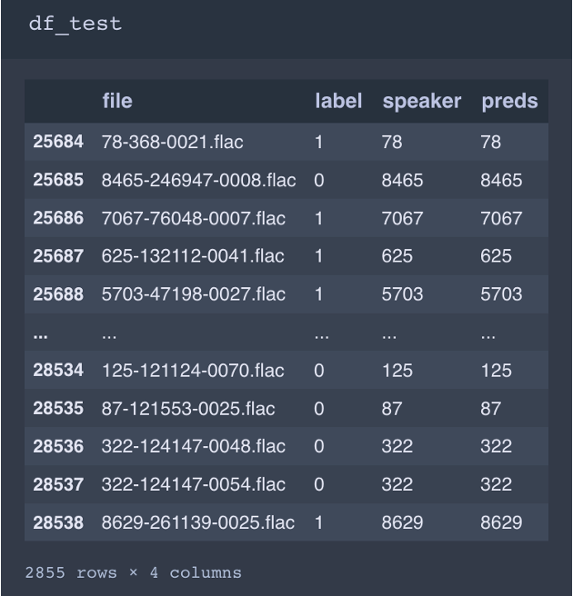

# Description
Using Neural Networks for Speaker Identification using clean-audio data

# Installation
Step 1: Create conda environment with python 3.9
Environment Name: audioclassifier
```
conda create -n "audioclassifier" python=3.9
```
Activate the environment and check python version
```
conda activate audioclassifier
python -V
>>> Python 3.9.x
```
**Scikit-Learn**

```
conda install -c anaconda scikit-learn
```

**Keras**
```
conda install -c conda-forge keras
```
**TensorFlow**
```
conda install -c conda-forge tensorflow
```
**Other dependencies**
```
pip install -r requirements.txt
```

# Code Rundown
1. Fire up `jupyter notebook` or `jupyter lab`
2. Use `SRC CODE.ipynb` to:
    * Get audio data from archived location
    * Extract audio features
    * Split Data 70|20|10 <> Train|Validate|Test
    * Train model over all the recordings
    * Test model's accuracy


# Results
* Model Training Results
    
* Model Predictions (All):
    
* Model Predictions (Wrong):
    
* Model Accuracy:
    

* Model Test:
    


# References
* https://subscription.packtpub.com/book/data/9781787125193/9/ch09lvl1sec61/identifying-speakers-with-voice-recognition
* https://github.com/orchidas/Speaker-Recognition
* https://towardsdatascience.com/voice-classification-with-python-4bec6856d06a
* https://mikesmales.medium.com/sound-classification-using-deep-learning-8bc2aa1990b7
* https://github.com/jurgenarias/Portfolio/tree/master/Voice%20Classification
* http://www.openslr.org/12/
* https://boto3.amazonaws.com/v1/documentation/api/latest/reference/services/connect.html
* https://github.com/amazon-connect/amazon-connect-streams
* https://www.folkstalk.com/tech/install-opencv-in-google-colab-with-code-examples
* https://colab.research.google.com/notebooks/gpu.ipynb
* https://www.simplilearn.com/tutorials/python-tutorial/speech-recognition-in-python
* https://towardsdatascience.com/a-step-by-step-guide-to-speech-recognition-and-audio-signal-processing-in-python-136e37236c24