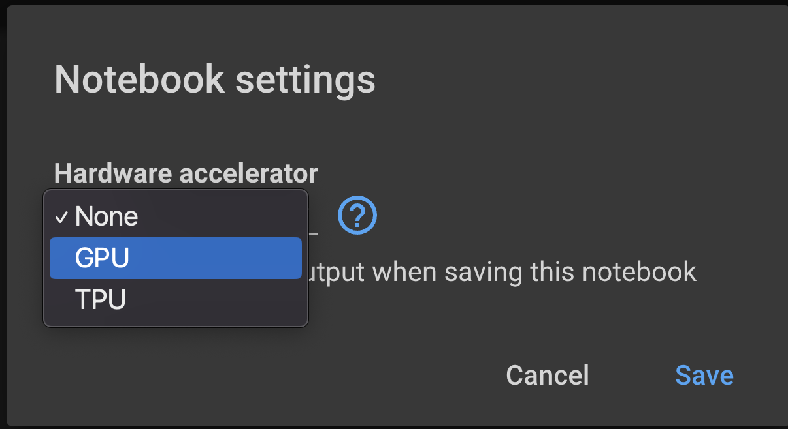
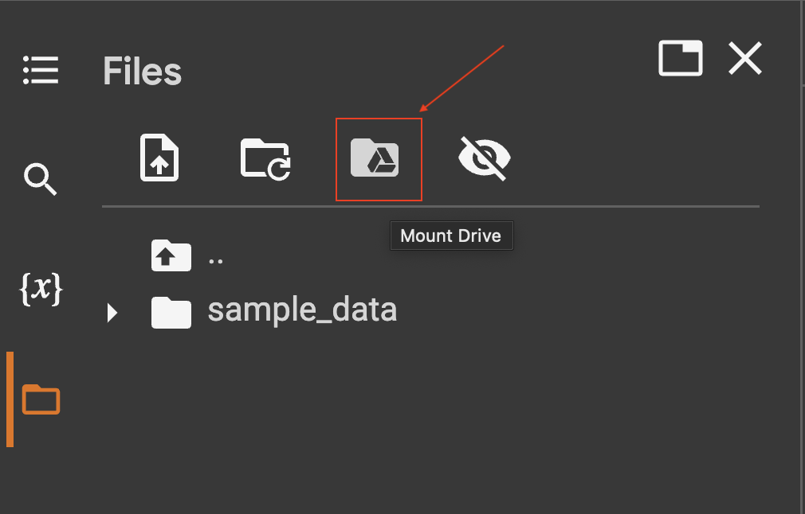
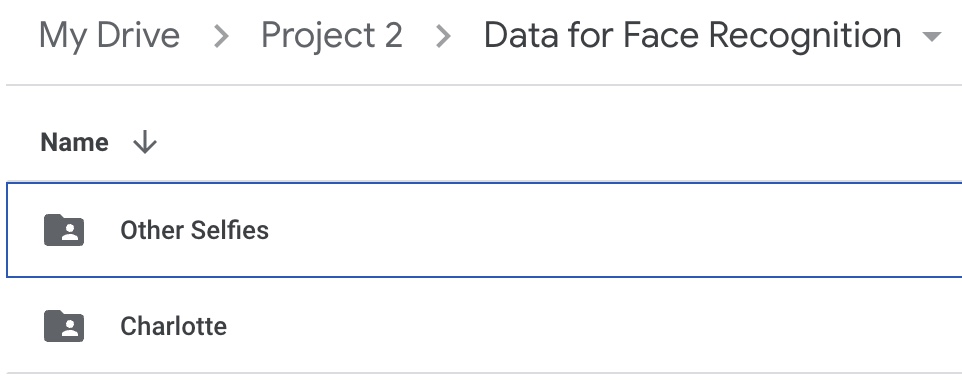
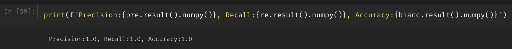
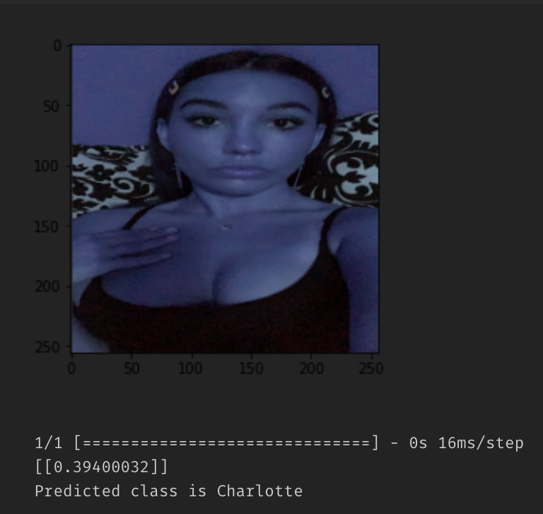

# Description
Using Convolutional Neural Networks for User Identification using Image data

# Setting up - Google Co-Lab
1. Start the Google Co-labs from Google Drive<br>
2. GPU selected (Runtime Settings)<br>
    
3. Mount Google Drive<br>
    
4. Install dependencies from the cell
    ```
    !pip install opencv-python matplotlib


# Setting up - Local Computer
**Installation**
Step 1: Create conda environment with python 3.9
Environment Name: imgclassifier
```
conda create -n "imgclassifier" python=3.9
```
Activate the environment and check python version
```
conda activate imgclassifier
python -V
>>> Python 3.9.x
```
**Scikit-Learn**
```
conda install -c anaconda scikit-learn
```
**Keras**
```
conda install -c conda-forge keras
```
**TensorFlow**
```
conda install -c conda-forge tensorflow
```
**Other dependencies**
```
pip install -r requirements.txt
```

# Code Rundown
1. Fire up `jupyter notebook` or `jupyter lab`
2. Use `CNNIMAGECLASSIFIER-v0.ipynb` to:
    * Load image data from archived location
    * Preprocess and Scale Images
    * Split Data 70|20|10 <> Train|Validate|Test
    * Create Compile and Train CNN
    * Check Model metrics
    * Evaluate model performance

> ## Data Management
* Folder Layout<br>

* `Charlotte/`
    > 50 different selfies of Charlotte
* `other Selfies/`
    > 50 random selfies from Google Images

**Results**

* Model Training Results
    
* Model Accuracy:
    
* Model Test:
    

**References**
* https://training.galaxyproject.org/training-material/topics/statistics/tutorials/CNN/tutorial.html
* https://www.edureka.co/blog/convolutional-neural-network/#z1
* https://www.youtube.com/watch?v=jztwpsIzEGc
* https://stackoverflow.com/questions/55767475/keras-is-not-learning-anything